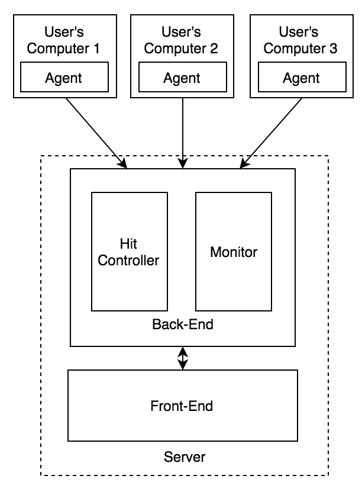

# HTTP log monitoring console program

A simple program that monitors HTTP traffic on your machine

### Features:
* Consume an actively written-to w3c-formatted HTTP access log (https://en.wikipedia.org/wiki/Common_Log_Format)
* Every 10s, display in the console the sections of the web site with the most hits (a section is defined as being what's before the second '/' in a URL. i.e. the section for "http://my.site.com/pages/create' is "http://my.site.com/pages"), as well as interesting summary statistics on the traffic as a whole.
* Make sure a user can keep the console app running and monitor traffic on their machine
* Whenever total traffic for the past 2 minutes exceeds a certain number on average, add a message saying that “High traffic generated an alert - hits = {value}, triggered at {time}”
* Whenever the total traffic drops again below that value on average for the past 2 minutes, add another message detailing when the alert recovered
* Make sure all messages showing when alerting thresholds are crossed remain visible on the page for historical reasons.
* Write a test for the alerting logic
* Explain how you’d improve on this application design

### Requirements
* Python
* pytest
* coverage

### Running the project
```
python main.py /Users/flavio/Desktop/monitor/log/file.log
```

### Running the tests

## Install Requirements
```
sudo pip install -r requirements.txt
```

## Run Tests
```
coverage run --source='.' -m py.test tests -v
```

### Genereating Logs
On the foler /log type to start generating the log files:
```
python loggenerator.py /Users/flavio/Desktop/monitor/log/file.log
```

### Architecture


### Improvements
* Add database to store stats data instead of variables
* Allow more than one log file to be monitored
* On the Collector avoid sending individual data to the DB, create and aggregator to make batches of 10seconds. This is to decrease the number of access to the DB
* Divide agent, server-backend and server-frontend in three different projects
* Use a modern framework on the frontend (AngularJS, React, ...)
* Use a modern framework on the backend (Django, Flask, ...)
* Change interface components to bring warnings from defined period (eg. last 12 hours)
* User pagination on the interface modules and allow more registers
* Use a modern real-time bidirectional event-based communication to alert the frontend that the backend has changed (e.g. when a warning is created on the server to update the screen)
* Create much more tests
